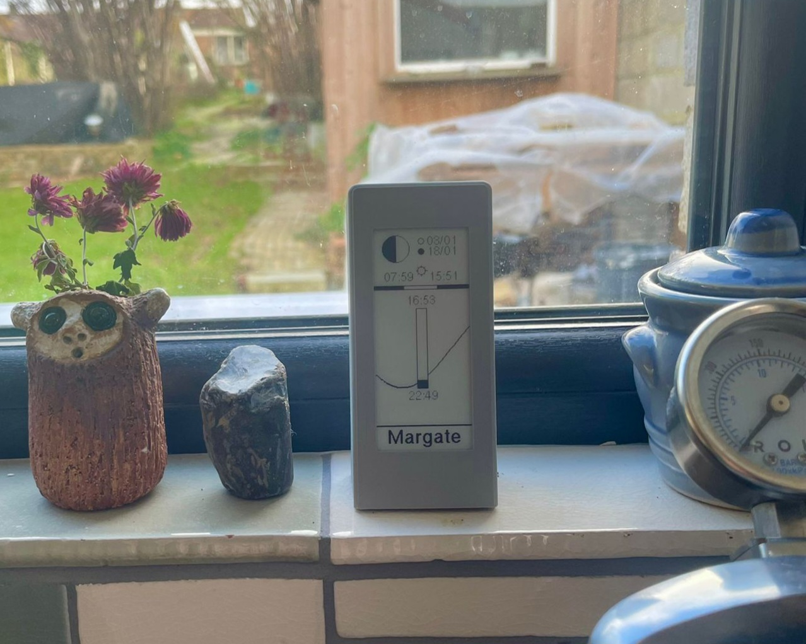
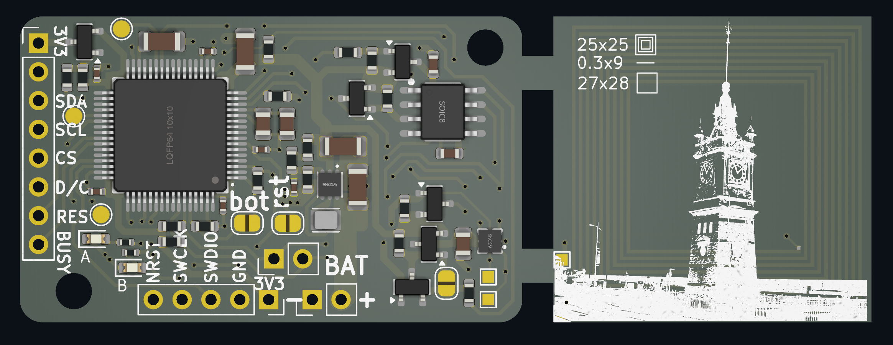
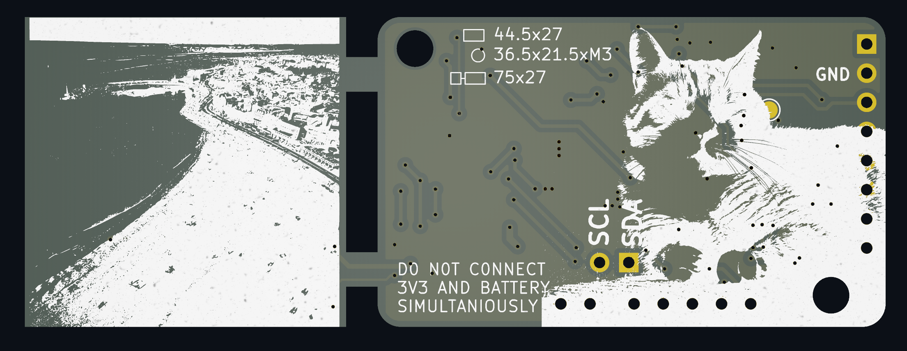

# Tide Clock

A battery-powered e-paper display showing tide times. Configurable for any coastal location.



## Features

- **Tide prediction** - Next high/low tide times using a 31-constituent harmonic model
- **Moon phase** - Current phase with upcoming full/new moon dates
- **Sunrise/Sunset** - Daily times with 24-hour daylight visualization bar
- **Special messages** - Solstices, equinoxes, eclipses, meteor showers, holidays
- **Offline operation** - Pure mathematical models, no internet required
- **Multi-year battery life** - 15-minute wake cycles with deep sleep between updates

## Hardware




- **MCU**: STM32F411RET6 (ARM Cortex-M4)
- **Display**: 2.9" e-paper (296x128, SSD1680 controller)
- **RTC**: DS3231MZ+ with alarm wake
- **Power**: AA batteries with TPS61099 boost converter

## Project Structure

```
tidal-clock/
├── firmware/          # STM32 firmware (Rev A & B)
├── simulator/         # SDL2 simulator for testing
├── scripts/           # Location config generation
│   └── harmonic_fitting/  # Tide model fitting
├── kicad/             # PCB designs
└── manual/            # User manual
```

Each folder has its own README with detailed instructions.

## Quick Start

### Simulator


```bash
cd simulator
sudo apt install libsdl2-dev
git clone https://github.com/olikraus/u8g2.git
make && ./tide_sim
```

### Firmware

```bash
cd firmware/revA  # or revB
cd lib && git clone https://github.com/olikraus/u8g2.git && cd ..
pio run --target upload
```

## Customizing Location

Configure for any coastal location. See [scripts/README.md](scripts/README.md) for details.

**US locations** (using NOAA API):
```bash
cd scripts
python3 generate_location.py --noaa 9414290 --name "San Francisco" --tz US_PACIFIC
```

**Other locations** (fit your own model):
```bash
python3 generate_location.py --json harmonic_fitting/model.json --name "Location" --tz UK
```

## License

MIT
