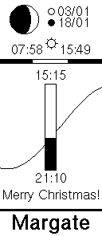

# Tide Clock

A battery-powered e-paper display showing tide times for Margate, UK. A low-power e-paper tide clock.



## Features

- **Tide prediction** - Next high/low tide times using a 31-constituent harmonic model (~5 min accuracy)
- **Moon phase** - Current phase with upcoming full/new moon dates
- **Sunrise/Sunset** - Daily times with 24-hour daylight visualization bar
- **Special messages** - Solstices, equinoxes, eclipses, meteor showers, holidays
- **Offline operation** - Pure mathematical models, no internet required
- **Multi-year battery life** - 15-minute wake cycles with deep sleep between updates

## Hardware

- **MCU**: STM32F411RET6 (ARM Cortex-M4)
- **Display**: 2.9" e-paper (296x128, SSD1680 controller)
- **RTC**: DS3231MZ+ with alarm wake
- **Power**: AA batteries with TPS61099 boost converter
- **Time setting**: Button to set time via display interface

## Project Structure

```
gift/
├── kicad/
│   ├── RevA/                   # Hardware Rev A (tested)
│   ├── RevB/                   # Hardware Rev B (not yet tested)
│   └── versions.md            # Hardware version changelog
├── manual/                     # User manual (PDF + LaTeX)
└── display-sim/
    ├── display-simulation/     # C simulator (SDL2)
    ├── firmware-revA/          # STM32 firmware for Rev A
    ├── firmware-revB/          # STM32 firmware for Rev B
    └── harmonic_fitting/       # Tide model fitting scripts
```

See [kicad/versions.md](kicad/versions.md) for hardware differences between revisions.

## Building the Simulator

```bash
# Prerequisites (Ubuntu/Debian)
sudo apt install libsdl2-dev gcc make

# Clone and build
cd display-sim/display-simulation
git clone https://github.com/olikraus/u8g2.git
make

# Run (opens SDL window)
./tide_sim

# Headless mode (generates PNG)
./tide_sim --headless
```

## Building the Firmware

```bash
# For Rev A hardware
cd display-sim/firmware-revA
cd lib && git clone https://github.com/olikraus/u8g2.git && cd ..
pio run
pio run --target upload  # via ST-Link

# For Rev B hardware
cd display-sim/firmware-revB
cd lib && git clone https://github.com/olikraus/u8g2.git && cd ..
pio run
pio run --target upload
```

## Tide Model

The tide prediction uses **31 harmonic constituents** fitted to Margate data from the Port of London Authority (2019-2026):

| Constituent | Period | Amplitude |
|-------------|--------|-----------|
| M2 (Principal lunar) | 12.42h | 1.624m |
| S2 (Principal solar) | 12.00h | 0.476m |
| N2 (Lunar elliptic) | 12.66h | 0.285m |
| K1 (Lunisolar diurnal) | 23.93h | 0.103m |
| O1 (Lunar diurnal) | 25.82h | 0.127m |
| + 26 more... | | |

Includes empirical corrections for the 18.61-year nodal cycle and seasonal variations.

## Astronomical Calculations

- **Moon phase**: Meeus algorithm with 15 periodic corrections
- **Sunrise/sunset**: NOAA algorithm for Margate (51.3813°N, 1.3862°E)
- **Eclipses**: Pre-computed table for 2025-2125

## Power Consumption

| State | Current | Duration | Notes |
|-------|---------|----------|-------|
| Sleep | ~20 µA | 15 min | STOP mode, RTC running |
| Wake | ~15 mA | ~4 sec | Display refresh |

**Estimated battery life** (2x AA, 2500 mAh):
- Average current: 20 µA + (15 mA × 4s) / 900s ≈ 87 µA
- Runtime: ~3.3 years

**Possible optimizations:**
- Sleep current could be reduced to ~10 µA with better power gating
- Wake current could be reduced with partial display updates

**Power management:**
- 15-minute wake cycle via DS3231 alarm interrupt
- Deep STOP mode between updates
- Full display refresh at 3am to clear ghosting

## License

MIT
